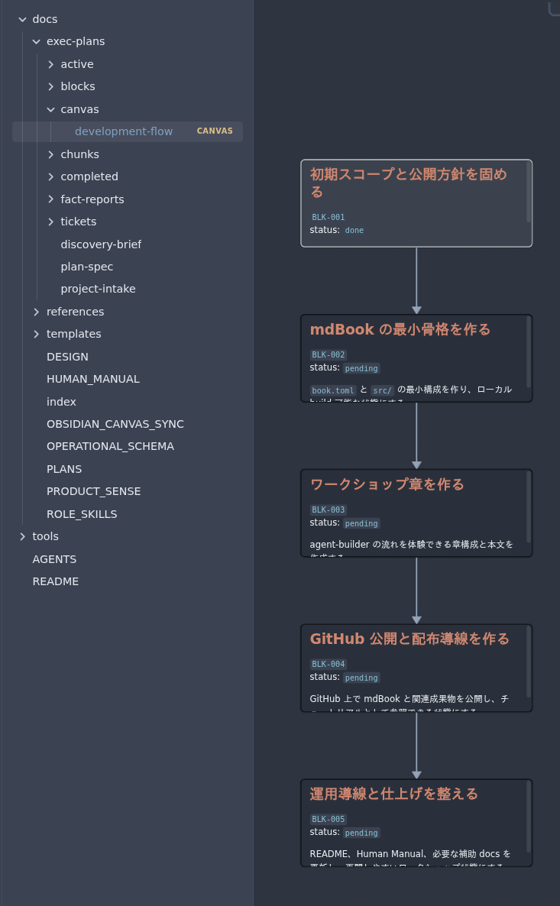

# plan-manager で骨子を組む

## セッションの開始
最初にやることは単純です。`$` コマンドで、展開された Skill の中から `plan-manager` を選んで呼び出すだけです。
Codex アプリとの同期がうまくいっていれば候補に出るはずです。

<br>
では、この mdBook を作るにあたって最初に投げた言葉を見返してみましょう。

```text
$plan-manager 環境を構築したところで、何もないんだけどどうすればいい？
```

こんな戯言でうまくいくとは思えませんが、実際これは覆すことのできない過去の出来事なので弁明の余地はありません。

しかし `docs-builder.toml` に何をやりたいかを書いていたのは幸運でした。

```toml
request = "何もない新規リポジトリから、agent-builder を使って mdBook のワークショップ記事サイトを作りたい。ワークショップ自体で plan-manager -> task-planner -> task-worker の流れも体験できるようにする。"
summary = "agent-builder の実運用を題材に、mdBook でワークショップ記事サイトを構築するプロジェクト"
```

<br>
これを足掛かりにして、`plan-manager` は以下のように返答しました。

```text
plan-manager として、環境構築済み / mdBook 未着手の現状を planning docs に反映しました。

project-intake.md (line 11) に追加ヒアリングを記録し、
～中略～
docs/exec-plans/canvas/development-flow.canvas も再同期済みです。

次に BLK-001 を閉じるため、以下だけ決めたいです。推奨はすべて「最小で始める」です。

1.初回ゴールはローカル完結でよいですか。それとも公開導線まで含めますか。
2.章構成は 4 章前後で進めますか。
3.mdBook の立ち上げは手動で作りますか。それとも mdbook init 併用にしますか。
4.必須品質ゲートは mdbook build だけでよいですか。
```

このようなインタビューに答えて、大まかな骨子を組み立てていきます。
私は `1.` については GitHub で公開するのをゴールと設定し、`2.` については「はい」、`3.` と `4.` については「わからない」と答えました。そもそも `mdbook` を使うのが初めてだったからです。

## plan-manager の役割

`plan-manager` は、要求整理と上流の計画更新を担当する role です。人間から受け取った要望をそのまま流すのではなく、確認済み事実、仮置き前提、未確定事項を分けながら、後続の role が迷わない骨組みへ整えます。

この段階で主に更新されるのは、次の docs です。

- `docs/exec-plans/project-intake.md`
- `docs/exec-plans/discovery-brief.md`
- `docs/exec-plans/plan-spec.md`
- `docs/exec-plans/blocks/*.md`

使い方はシンプルで、「何を作りたいか」と「いま分かっていること」を `plan-manager` に渡します。すると `plan-manager` は、block 単位の実行計画へ落とし込み、必要なら「何を先に決めるべきか」も返します。

たとえば今回の project では、mdBook を作ること自体よりも、`agent-builder-kit` を使った docs 駆動フローをどうワークショップ化するかが主題でした。そのため `plan-manager` は、公開ゴール、章構成、記録基盤、公開導線といった論点を block に分けて整理するところから始めています。

大事なのは、ここで細かい実装へ飛ばないことです。まず骨子を作ってから、次の `task-planner` が chunk と ticket へ分解する流れに入ることで、あとから見返しても追いやすい開発フローになります。

## `.canvas` によるフローの視覚化

`agent-builder-kit` には、現在の docs の内容を汲み取って開発フローを視覚化する `obsidian-canvas-sync` が組み込まれています。
このSkillを明示的に呼び出す必要はありません。
`plan-manager` や `task-planner`, `task-worker` がその仕事を終えると、自動的にこの Skill を呼び出し、`.canvas` ファイルを更新します。

Obsidianで`docs/exec-plans/canvas/development-flow.canvas`を開き、進捗フローをリアルタイムに確認しながら開発業務を進めることができます。

このようなチャートがあれば、次に目指すべきブロックと何をやったかが明確になり、どこに新しい機能を追加するかも検討しやすくなるでしょう。

ハーネスエンジニアリングの特徴のひとつであるタスクの細分化は、エージェントの仕事をより高品質にしますが、その分その進捗を文章として追い、脳で処理する人間の負担は増えます。
Obsidianのような専用のViewerを使い、他のドキュメントに目を通す際にも有用です。

以下は、先述した `plan-manager` とのやり取りを踏まえて生成されたものです。
今はこのように単一のフローですが、次に `task-planner` を呼び出すことでどう発展するのかにも注目してください。

