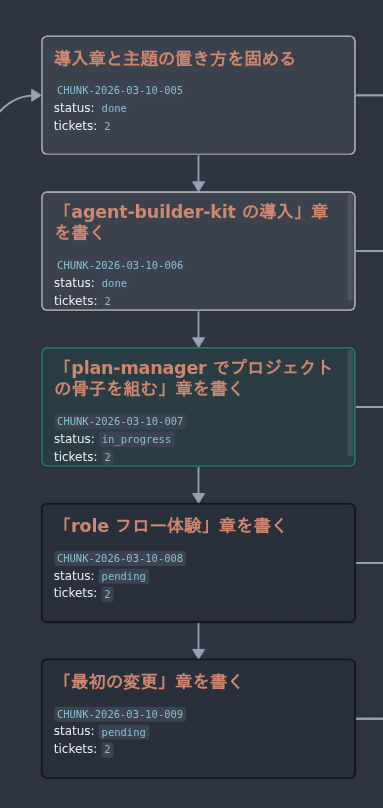
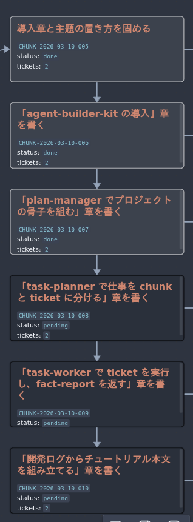
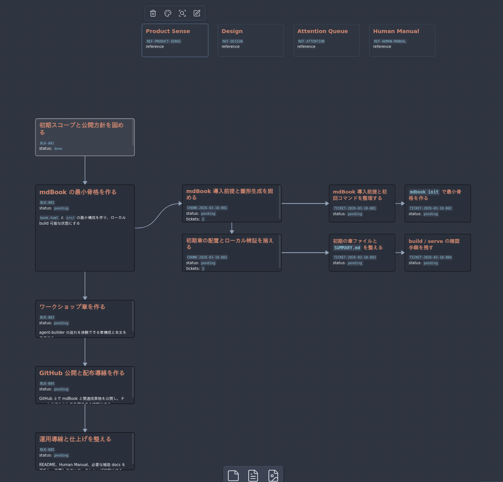
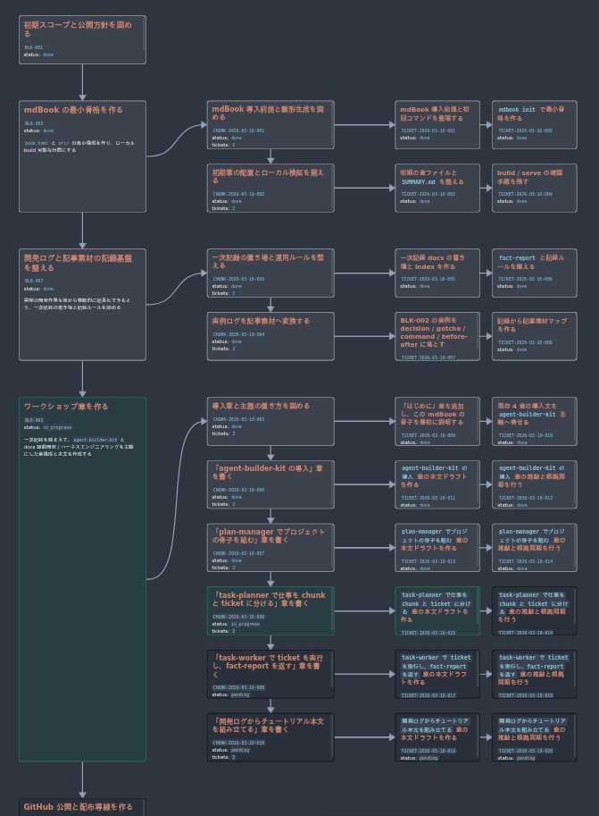

# task-planner で仕事を chunk と ticket に分ける

`plan-manager` が project の骨子を block にまとめたら、次は `task-planner` の出番です。
ここでは、その block をそのまま眺めて終わるのではなく、実際に手を動かせる大きさまで分解していきます。

## task-planner の役割

`task-planner` は、block を実行可能な単位へ分ける role です。
読むものは主に `plan-spec.md` と `blocks/*.md`、書き出すものは `chunks/*.md` と `tickets/*.md` です。

やっていることは単純で、次の二段階に分けて考えると分かりやすくなります。

- まず block を、意味のまとまりごとに `chunk` へ分ける
- そのあと各 chunk を、`task-worker` が独立して進められる `ticket` へ分ける

ここで重要なのは、最初から細かく切りすぎないことです。
逆に大きすぎる chunk や ticket を作ると、次に何をやるかが曖昧になり、role の境界もぼやけます。

## task-planner の使い方

使い方は `plan-manager` と同じで、Codex アプリから Skill を呼び出します。
この project では、次のように依頼しました。

```text
$task-planner ブロック2のチャンク化をおねがい。ちなみに私はmdbookのことはﾅﾆﾓﾜﾗｶﾝ
```

この一文だけでも、`task-planner` は block の目的と利用者の前提知識を読み取り、分解の粒度を調整します。
今回は `mdbook` 初学者向けに進める必要があったため、いきなり公開設定や装飾へ進まず、導入と確認を先に済ませる構成になりました。

## block を chunk に分ける

実例として、`BLK-002` では mdBook の初期セットアップを扱っていました。
これを `task-planner` は、次の 2 つの chunk に分けています。

- `CHUNK-001`: mdBook 導入前提と雛形生成を固める
- `CHUNK-002`: 初期章の配置とローカル検証を揃える

この分け方のポイントは、導入と検証を同じ箱に押し込めなかったことです。
先に入口と骨格生成を固め、そのあとで章の配置と build 確認へ進めることで、後続の `task-worker` が一本道で動きやすくなります。

## chunk を ticket に分ける

chunk を切っただけでは、まだ `task-worker` は動きません。
そこで `task-planner` は、各 chunk をさらに ticket へ分けます。

`CHUNK-001` では次の 2 ticket になりました。

- `TICKET-001`: mdBook 導入前提と初回コマンドを整理する
- `TICKET-002`: `mdbook init` で最小骨格を作る

`CHUNK-002` では次の 2 ticket になりました。

- `TICKET-003`: 初期の章ファイルと `SUMMARY.md` を整える
- `TICKET-004`: build / serve の確認手順を残す

このように見ると、ticket は「1 回の実装依頼として無理なく完結する単位」になっていることが分かります。
役割ごとに言い換えるなら、chunk は人間が進め方を把握するためのまとまりで、ticket は `task-worker` が手を動かすための最小単位です。

## chunk はあとから更新してよい

chunk は一度切ったら固定されるわけではありません。
むしろ、配下の ticket がすべて完了したあとこそ、いまの進捗と計画がまだ噛み合っているかを見直すタイミングになります。

たとえば、当初の chunk を最後まで進めてみてから、

- 現在の進捗と少しずれてきた
- この流れなら別の機能を足したくなった
- 次に進む前に、記録や検証のまとまりを追加したくなった

といったことが起こります。
そういうとき `task-planner` は、必要な更新が「いまの block の中に差し込む chunk なのか」、それとも「もっと上流で扱うべき新しい block なのか」を見ます。

block の目的に沿った追加であれば、現在の block に新しい chunk を差し込みます。
一方で、目的そのものが増えていたり、公開方針や記録方針のように上流判断が必要なら、`task-planner` は無理に追加せず、人間へ「これは block 単位で扱ったほうがよい」と返します。

このようにして、あとから必要になった chunk や block、ticket も、それぞれの境界と責務を見ながら適切な場所へ再配置されます。

以下は、chunk 更新前と更新後のイメージです。

<br>
更新前: 仮決めしていた章の構成が、タスク進行とともに噛み合わなくなった



更新後: `task-planner` に推敲を依頼し、軌道を修正



## task-worker へどう渡すか

良い ticket には、少なくとも次の 3 つが入っています。

- 何を達成するかを示す `Goal`
- どこを触ってよいかを限定する `editable_paths`
- 完了をどう確かめるかを示す `Verification`

これがあると、`task-worker` は scope を大きくはみ出さずに作業できます。
逆にここが曖昧だと、実装の迷いが増え、あとで review や記録も難しくなります。

`task-planner` は本文そのものを書かない代わりに、次の role が迷わないための枠組みを整える仕事をしています。

## `.canvas` で分解後の姿を見る

chunk と ticket に分解されると、Obsidian の `.canvas` でも流れがかなり見やすくなります。
block だけだったときは「何をやるか」しか見えませんでしたが、chunk と ticket が入ると「次に誰が何をするか」が視覚的に追えるようになります。

この project では、`task-planner` が分解と差し込みを進めた結果として、開発フローが段階的に広がっていきました。

プロジェクト初期:


プロジェクト中盤:



ここまでできると、次は `task-worker` が各 ticket を順に実行し、`fact-report` と一緒に事実を返す段階へ進めます。
